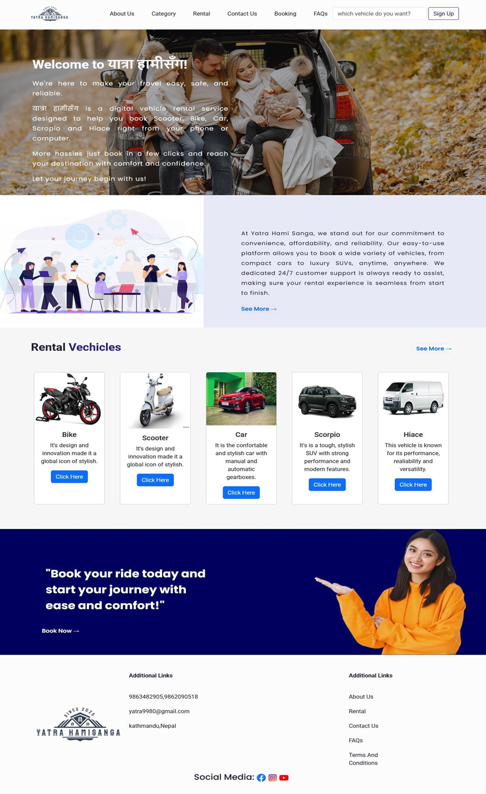
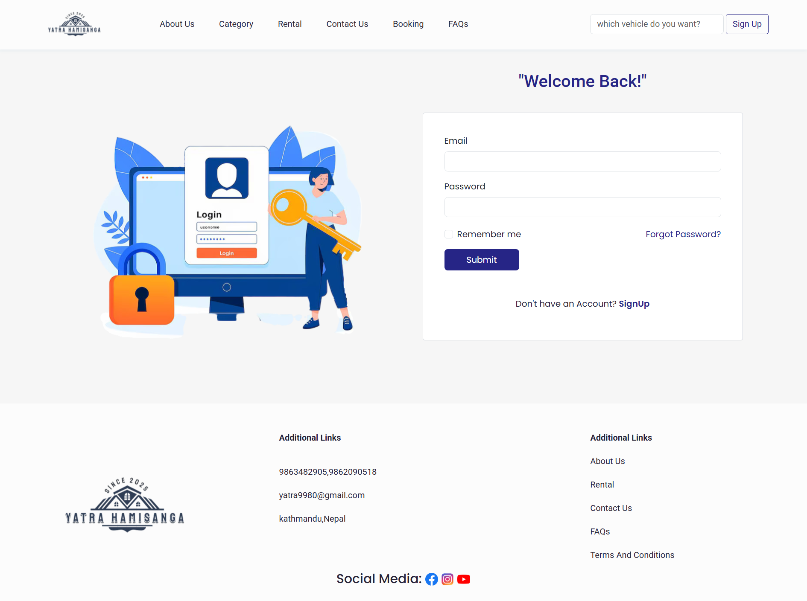
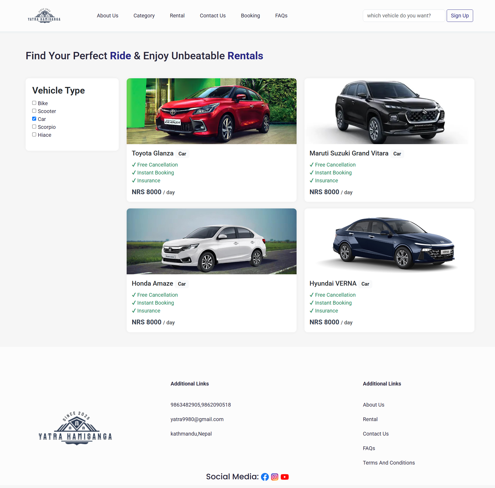
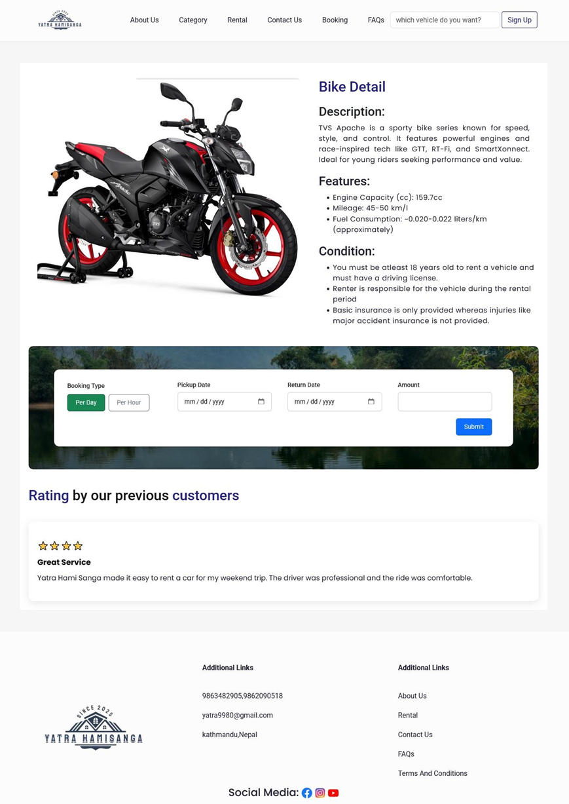
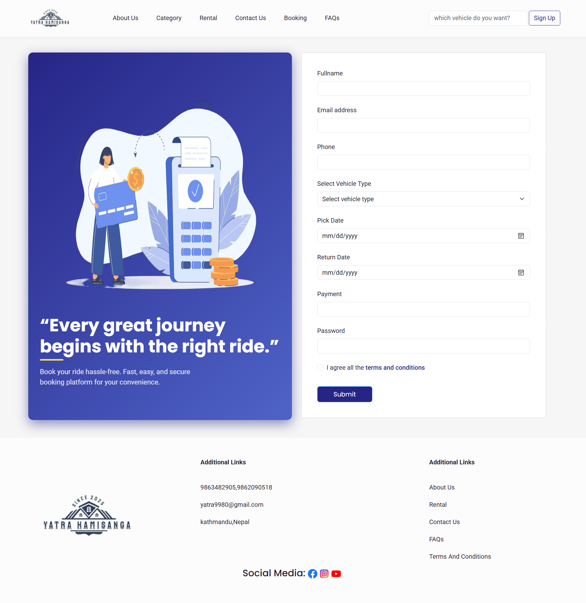
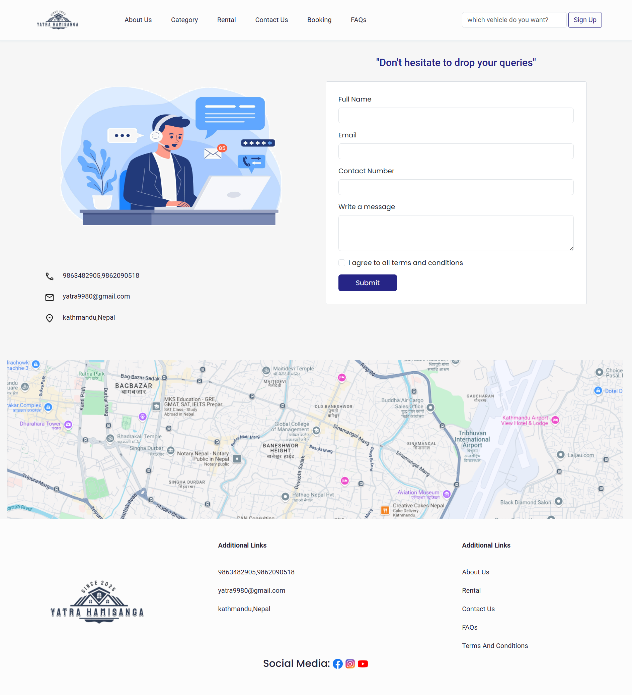

# YatraHamiSanga

A full-stack vehicle rental web application developed using Laravel and MySQL. The system enables users to browse available vehicles, make bookings and securely manage their accounts while providing administrators with tools to manage vehicles, bookings and users.

## Features

- User registration and login
- Forgot password functionality
- Vehicle listing and search
- Vehicle booking system
- Booking management
- Admin dashboard
- Secure authentication

## Tech Stack

- PHP
- Laravel
- MySQL
- HTML
- CSS
- JavaScript
- Bootstrap

## Installation

1. Clone the repository

```bash
git clone https://github.com/manisha0326/YatraHamiSanga.git
```

2. Install dependencies

```bash
composer install
```

3. Configure the `.env` file.

4. Generate the application key

```bash
php artisan key:generate
```

5. Run migrations

```bash
php artisan migrate
```

6. Start the development server

```bash
php artisan serve
```

## Screenshots

### Home Page



### Login Page



### Rental Page



### Description Page



### Booking Page



### Contactus Page



## Author

**Manisha Mahato**
**Reeja Maharjan**
**Shristi Aryal**
